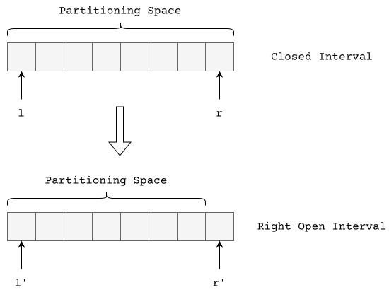

+++
title = "Generalization"
date = "2026-02-14"
summary = "Binary Partitioning - Generalized"
math = true
tags = ["math", "algorithms"]
toc = true
readTime = true
+++

Before reading this post, I would request you to first take a look at [Binary Partitioning - Introduction](/articles/binary-partitioning/introduction/)

## Context

Let $(start, size)$ be a pair denoting a span of the partitioning space with $size$ denoting the size and $start$ denoting the position. We had defined the invariant as $(start, size)$ tracking the **unvisited partitioning space**.

We had assumed that $[l, r]$ represents the partitioning space as a **closed interval**. This is very important for the next part.

In our last implementation, we wrote this code:

```python {title = "Binary Partitioning"}
from typing import Callable

def partition(l: int, r: int, f: Callable[[int], bool]) -> tuple[int, int]:
    start = l
    size = r - l + 1
    while size > 0:
        half = (size + 1) // 2
        if f(start + half - 1):
            size = half - 1
        else:
            start += half
            size //= 2
    return start-1, start
```

## Right-Open Interval

The algorithm above is mathematically correct. There is one problem with this approach - the partitioning interval is closed. 

Computer Scientists prefer half open intervals - $\left [l, r \right )$. This interval can represent empty ranges as well as non-empty ranges.



## Properties

1. The start index remains the same $\implies l' = l$
2. The end index is one ahead $\implies r' = r + 1$

Substituting $r = r' - 1$ and $l = l'$ we get,

```python {title = "Binary Partitioning"}
from typing import Callable

def partition(l: int, r: int, f: Callable[[int], bool]) -> tuple[int, int]:
    start = l
    size = r - l
    while size > 0:
        half = (size + 1) // 2
        if f(start + half - 1):
            size = half - 1
        else:
            start += half
            size //= 2
    return start-1, start
```


## Property Testing

```py
import main
from hypothesis import given, strategies as st
from hypothesis import settings, Verbosity
from unittest import TestCase

class TestPartition(TestCase):
    @given(
        bounds=st.tuples(st.integers(), st.integers()).map(sorted),
        pivot=st.integers(),
    )
    @settings(max_examples=10000)
    def test_fuzz_partition(self, bounds: tuple[int, int], pivot: int) -> None:
        l, r = bounds

        def f(x: int) -> bool:
            return x >= pivot
        
        idx_false, idx_true = main.partition(l=l, r=r, f=f)

        assert idx_true == idx_false + 1
        
        if l <= idx_false < r:
            assert f(idx_false) is False
        
        if l <= idx_true < r:
            assert f(idx_true) is True

        if idx_true < r:
            assert f(idx_true) is True
```

### Output

```bash {title="Running Tests"}
$ python -m unittest test  
.
----------------------------------------------------------------------
Ran 1 test in 8.249s

OK
```

## Full-Open Interval

Let's try to modify the algorithm to consider $\left (l, r \right )$. This interval can represent empty ranges as well as non-empty ranges.

## Properties

1. The start index remains the same $\implies l' = l - 1$
2. The end index is one ahead $\implies r' = r + 1$

Substituting $r = r' - 1$ and $l = l' + 1$ we get,

```python {title = "Binary Partitioning"}
from typing import Callable

def partition(l: int, r: int, f: Callable[[int], bool]) -> tuple[int, int]:
    start = l + 1
    size = r - l - 1
    while size > 0:
        half = (size + 1) // 2
        if f(start + half - 1):
            size = half - 1
        else:
            start += half
            size //= 2
    return start-1, start
```
