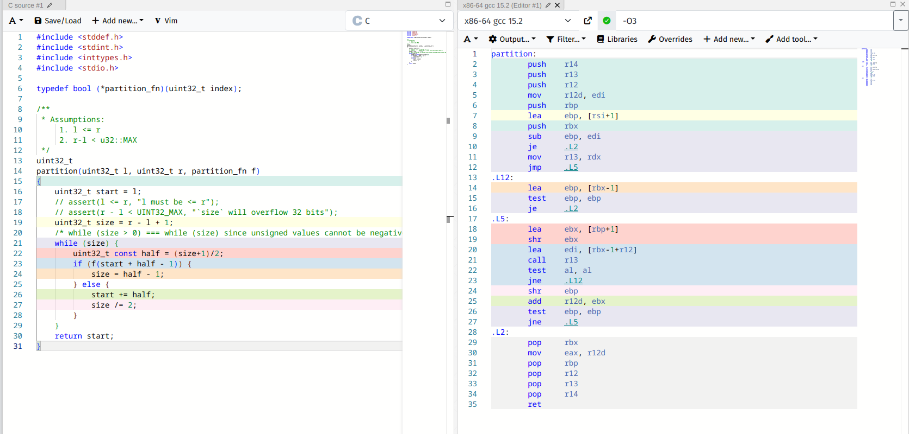
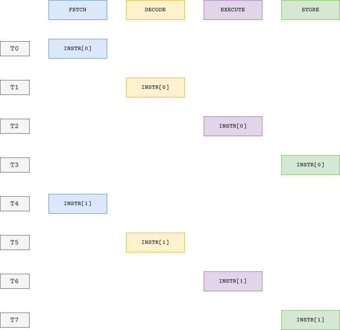
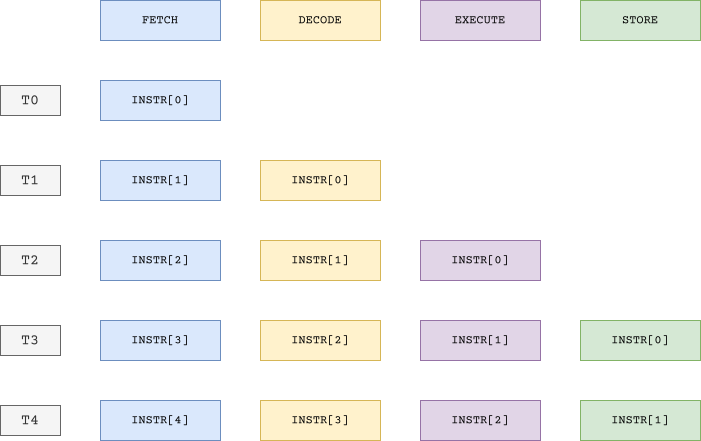
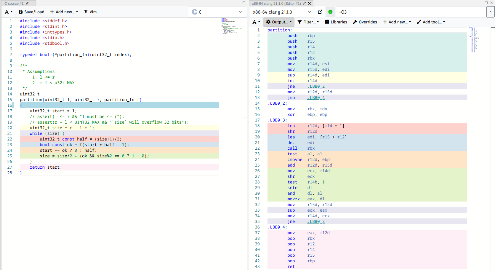

+++
title = "Optimization"
date = "2026-02-07"
summary = "Diving into x86-64 assembly"
math = true
tags = ["math", "algorithms"]
toc = true
readTime = true
+++

Before reading this post, I would request you to first take a look at [Binary Partitioning - Introduction](/articles/binary-partitioning/introduction/)

# Context

Let $(start, size)$ be a pair denoting a span of the partitioning space with $size$ denoting the size and $start$ denoting the position. We had defined the invariant as $(start, size)$ tracking the **unvisited partitioning space**.

We had assumed that $[l, r]$ represents the partitioning space as a **closed interval**. This is very important for the next part.

In our last implementation, we wrote this code:

```python {title = "Binary Partitioning"}
from typing import Callable

def partition(l: int, r: int, f: Callable[[int], bool]) -> tuple[int, int]:
    start = l
    size = r - l + 1
    while size > 0:
        half = (size + 1) // 2
        if f(start + half - 1):
            size = half - 1
        else:
            start += half
            size //= 2
    return start-1, start
```

I will be using C now, since we are diving into a bit lower level semantics:

```c {title = "Binary Partioning"}
typedef bool (*partition_fn)(uint32_t index);

/**
 * Assumptions:
     1. l <= r
     2. r-l < u32::MAX
 */
uint32_t
partition(uint32_t l, uint32_t r, partition_fn f)
{
    uint32_t start = l;
    assert(l <= r, "l must be <= r");
    assert(r - l < UINT32_MAX, "`size` will overflow 32 bits");
    uint32_t size = r - l + 1;
    /* while (size > 0) === while (size) since unsigned values cannot be negative */
    while (size) {
        uint32_t const half = (size+1)/2;
        if (f(start + half - 1)) {
            size = half - 1;
        } else {
            start += half;
            size /= 2;
        }
    }
    return start;
}
```

Taking a quick look at the assembly generated by GCC 15.2 (x86-64), ignoring the `assert`s for now, it's looks pretty neat



Let's now see if we can try to remove the jump instructions like `je`, `jne` which are generated by the `if` statement.

## Pipeline

Let's take a 1K foot overview on how CPU executes instructions. For simplicity, let's also assume the CPU does not access memory.

A CPU has a collection of registers (word sized). The next instruction address is stored in $pc$ register ($rip$ in x86-64 CPUs).

1. Fetch the opcode at $pc$ and update $pc$
2. Decode the operands.
3. Execute the instruction.
4. Write the result into a store-buffer.

### Basic Implementation

The CPU could simply execute steps one at a time.



### Notes

* Time taken (CPU clocks) to execute one instuction - $m$ where $m$ is the number of stages. In the above example, $m = 4$
* Time taken to execute $n$ instructions - $m \times n$ clock cycles (quadratic!!)

### Problems

The problem with the above approach is while the CPU is executing one instruction one a stage $S$, the other stages are idle.

### Basic Pipelined Design



### Notes

* Time taken to fill the pipeline = $m$ clock cycles (or clocks)
* Time taken to execute the $1^{st}$ instruction = $m$ clocks
* Time taken to execute the $2^{nd}$ instruction = $m+1$ clocks
* Time taken to execute the $n^{th}$ instruction = $m+n-1$ clocks

$$
\begin{align*}
speedup &= \frac{m\times n}{m+n-1} \\
 &= \frac{m}{\frac{m-1}{n} + 1}
\end{align*}
$$

* As we increase the number of instructions, the speedup gets capped at $m$ because
$$
\lim_{n \to \infty} \frac{m}{\frac{m-1}{n} + 1} = m
$$

## Control Hazard

The code is perfectly fine. But there is a problem - $f$ evaluates to $true$ or $false$ with a 50% probability. That means the CPU cannot speculate which branch to take. The decision can only be made when $f$'s result is ready in the pipeline.

What happens if the CPU completes execution of $\texttt{INSTR[2]}$ and the result of it indicates a branch to $\texttt{INSTR[10]}$?

The CPU has to flush out (clear) the previous stages and start fetching from $\texttt{INSTR[10]}$, this is termed as **Pipeline Stall**

## Predication

Predication is the process of replacing an instruction with it's conditional equivalent, so that the CPU pipeline does not get stalled due to jumps.

By doing this, **control flow dependencies** become **data dependencies**. Because the control flow is *linear* now.

You might have observed that the transformation of $size$ is _asymmetric_. Let's try to remove the $then$ part of the $if$ statement. We observe that

| $f(start + half - 1)$ | $size$ |
| --- | --- |
| $true$ | $\lfloor(size+1)/2\rfloor - 1$ |
| $false$ | $\lfloor size/2 \rfloor$ |

Let's now include the parity of $size$ into the observation

| $size \pmod 2$ | $f(start + half - 1)$ | $size$ |
| --- | --- | --- |
| 0 | $true$ | $\lfloor(size+1)/2\rfloor - 1 \implies \textcolor{red}{\lfloor size/2 \rfloor - 1}$ |
| 0 | $false$ | $\lfloor size/2 \rfloor \implies \lfloor size/2 \rfloor $ |
| 1 | $true$ | $\lfloor(size+1)/2\rfloor - 1 \implies \lfloor size/2 \rfloor $ |
| 1 | $false$ | $\lfloor size/2 \rfloor \implies \lfloor size/2 \rfloor$ |

This means we can remove the $then$ clause and use a conditional to check if $size$ is even and $f$ returns $true$.

Here's a little trick: The ternary operator in C `<expr> ? <rv1> : <rv2>` can be used to instruct the compiler to generate conditional instructions.


```c {title = "Binary Partioning"}
typedef bool (*partition_fn)(uint32_t index);

/**
 * Assumptions:
     1. l <= r
     2. r-l < u32::MAX
 */
uint32_t
partition(uint32_t l, uint32_t r, partition_fn f)
{
    uint32_t start = l;
    // assert(l <= r && "l must be <= r");
    // assert(r - l < UINT32_MAX && "`size` will overflow 32 bits");
    uint32_t size = r - l + 1;
    while (size) {
        uint32_t const half = (size+1)/2;
        bool const ok = f(start + half - 1);
        start += ok ? 0 : half;
        size = size/2 - (ok && size%2 == 0 ? 1 : 0);
    }
    return start;
}
```

Taking a quick look at the assembly generated by clang 21.1.0 (x86-64), we find that the control flow dependent jumps are removed using conditional instructions



It looks like gcc 15.2 is still not able to translate the above ternary operators to conditional instructions.
