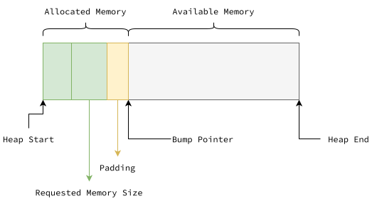
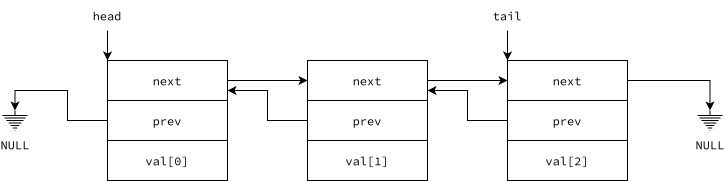
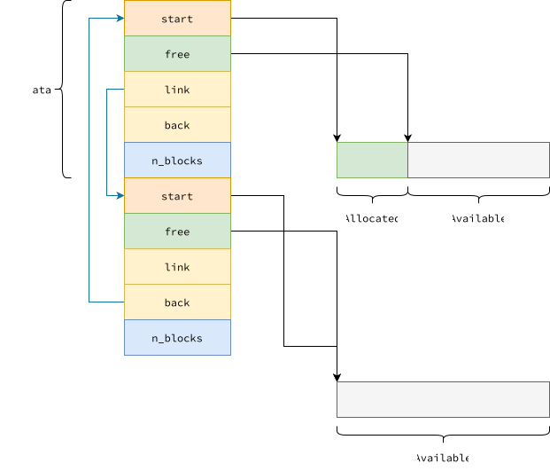

+++
date = "2026-02-01"
title = "Part 1 - Bump Allocator"
summary = "Memory Allocation"
tags = ["haskell"]
math = true
toc = true
readTime = true
+++

In this post, we are going to cover how GHC allocates memory using bump allocator.

## Problem Statement

> How do we design an efficient allocator for small objects (<= 4 KiB)

## Bump Allocation

Let's first talk about what is bump allocation.

> What is a bump allocator?

Bump allocation is a simple method of allocating memory, where a pointer tracks the next available free memory space. It is incremented (or bumped) by the required size of allocation.



A bump allocator contains the following:

- Starting address of the region in heap
- End Address or the length of the allocated region
- Free pointer to the next available address in the region

### Advantage

- Memory Allocation is $O(1)$
- Deallocating _all_ the allocated memory blocks can be performed in constant time $O(1)$

### Disadvantage

- Individual memory blocks cannot be de-allocated.

### Implementation

Here's a simple example of how bump allocators can be implemented.

```c {title="Bump Allocator"}
struct bump_allocator {
    uint8_t *start; /* start address of heap region, inclusive */
    uint8_t *end;   /* end address of the heap region, exclusive */
    uint8_t *ptr;   /* pointer to next available address */
};

/**
 * ba_init: initialize the bump allocator
 */
void
ba_init(struct bump_allocator *ba, void *start, void *end)
{
    ba->start = (uint8_t*) start;
    ba->end = (uint8_t*) end;
    ba->ptr = (uint8_t*) start;
}

/**
 * ba_alloc: request a memory of `n_bytes` bytes
 */
void
*ba_alloc(struct bump_allocator *ba, size_t n_bytes)
{
    /* align up to a multiple of 8 */
    size_t const aligned_size = (n_bytes + 7) & -(size_t)8;
    if (ba->ptr + aligned_size >= ba->end) {
        ba_fatal("Error - ba_alloc(size: %zu) failed, due to out of memory", n_bytes);
    }
    void *rv = ba->ptr;
    ba->ptr += aligned_size;
    return rv;
}

/**
 * ba_reset: free all the allocated blocks
 */
void
ba_reset(struct bump_allocator *ba)
{
    ba->ptr = ba->start;
}
```

### Scalability Issues

This is great! But how do we scale it?

> Resize the region every time we run out of memory.

But there are problems with this approach:

###### Copying regions

$O(n)$ time complexity required to copy the data into the newly allocated region.

###### Frequent Allocations

Memory allocations using `malloc` or `calloc` are costly.


## Linked Lists

Linked list is a way to connect similiar data structures located in non-contiguous memory regions.

Here's a simple example of a linked list, that links integers

```c {title="Linked List"}
struct int_list {
    struct int_list *next;
    struct int_list *prev;
    int val;
};
```

Here's how it looks like in memory:



Say, if we want to create a collection of students and connect them with linked list, will the above definition work?
> No, because, the semantics of linked list are tightly connected with the data being stored.

```c {title="Linked List"}
struct student_list {
    struct student_list *next;
    struct student_list *prev;
    char *name;
    int marks;
};
```

How do we make it reusable?
> We need to separate the linked list part from the data being stored.

```c {title="Generic Linked List"}
struct list_entry {
    struct list_entry *next;
    struct list_entry *prev;
};
```

That's it! Now if we refactor `int_list` and `student_list`, it would look like:

```c {title="Generic Linked List (Example)"}
struct int_list {
    struct list_entry node;
    int val;
};

struct student_list {
    struct list_entry node;
    char *name;
    int marks;
};
```

Now, let us take a step back into the [Scalability of Bump Allocators](#scalability)

If we use linked lists to store the bump allocators, we solve the [first problem](#copying-regions)

```c {title="Bump Allocator Collection"}
struct bump_allocator_collection {
    struct list_entry node;
    struct bump_allocator allocator;
};
```

Now we have another problem - **Linked Lists are not cache friendly!**

Modern systems have L1 and L2 caches to speed up memory loads. If we are looking up a word, if it is present in cache, the access time would be ~50x faster than accessing directly from Main Memory. A cache works by prefetching neighbouring words from Main Memory.

Let's say we have some allocators at different memory locations. When we try to traverse this linked list of allocators, there will be cache misses due to the fact that the pointers are not stored in neighbouring memory locations.

The solution to this would be to make the allocators contiguous and make the memory regions they allocate into contiguous.

Considering this, now we have the following:

## Refactored Arena

")

> The problem of frequent allocation remains. How do we solve it?

Let's try to make the problem mathematical:

- Let $A$ be the size of the memory region _owned_ by each allocator
- Let $N$ be the number of allocators

Constraints:
- If $A$ is too less, we would be having to search the allocators more often for free memory - **inversely proportional to frequency**.
- If $N$ is too high, we would be consuming more time in searching the allocators for free memory - **directly proportional to iterations**.

The Haskell team did an ingenious work! They've done the following:

1. $A = 2^{12}\ bytes$
2. $N = 2^8$

The above assignment solves the [second problem](#frequent-allocations). Well, how?

### Translation Lookaside Buffer (TLB)

Let us take a step back into how our CPUs access the main memory from a given address. 

")

Our CPUs have Translation Lookaside Buffer(TLB) which works just like a cache but instead stores a mapping of virtual page address to physical page address. This TLB has a fixed size.

Now, with frequent memory allocations, the TLB reaches its capacity; leading to evicting of existing mappings - this is TLB miss.

When an virtual page number is not found in the TLB, the CPU resorts to page table lookup. The page table is in Main Memory, which means memory addresses are going to be de-referenced and looked up in the Main Memory. This process is slower

To avoid this issue, most operating systems support a feature called Huge-Pages. With this, pages of size `1 MiB`, `2 MiB` et. cetera can be allocated with a single TLB entry.

Going back to the parameters, we see the total size of the allocation $$N \times A = 2^{12} \times 2^8 = 1\ MiB$$

- First, GHC requests memory from the OS in units of megablocks (1 MiB each). This size reduces the number of expensive system calls and plays well with typical TLB sizes: a 1 MiB region can be covered by fewer TLB entries, reducing page table misses and improving access locality
- Second, each bump allocator is given `4 KiB` of chunk which is same as the default page size in x86-64 CPUs. Because most allocations are small, this avoids large internal fragmentation
- [Third](/articles/ghc-internals/allocation/block-addressing/#algorithm), the most beautiful - given an address to a word, the address of the allocator can be computed **without any memory lookups**

## GHC Bump Allocator

Metadata for a block contains the following fields

- `start`
  : Pointer to the start of the corresponding data block
- `free`
  : Pointer to the next available address in the corresponding data block
- `link`
  : Pointer to the next metadata structure
- `prev`
  : Pointer to the previous metadata structure
- `flags`
  : Word denoting the type of the allocated data blocks
- `n_blocks`
  : Number of data blocks

Here is how it looks




## Takeways

- Bump allocator: Fast pointer bumping for short-lived allocations; simplicity + speed > per-object de-allocation
- 1 MiB blocks: Reduce OS calls, improve TLB/cache locality, simplify GC tracking.
- 4 KiB blocks: Matches OS page size, enables fine-grained memory tracking, improves cache performance for small objects.
