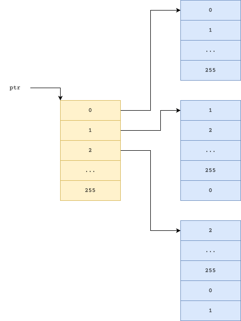

+++
title = "MoVfuscator"
date = "2026-02-14"
summary = "Introduction to MoVfuscator"
math = true
tags = ["re"]
toc = true
readTime = true
+++

## Turing Completeness

A language is said to be turing complete if it can simulate a [Turing Machine](https://en.wikipedia.org/wiki/Turing_machine).

If you are not that familiar with the Theory of Computation, you can think like if the language can evaluate a [Brainfuck](https://en.wikipedia.org/wiki/Brainfuck) program, it is turing complete.

## Context

The x86-64's [`mov`](https://c9x.me/x86/html/file_module_x86_id_176.html) instruction is turing complete - well some help is required from the underlying OS as well, but this is surprising isn't it?


## Implementation

### Addition

$8$ bit addition is implemented using memory addressing. $2^n$ bit addition is implemented by splitting across $8$ bit additions and propagating the carry.



```asm
mov eax, ptr
mov eax, [eax + r1]
mov eax, [eax + r2]
```

This performs addition of $R_1$ and $R_2$

> Work in progress...
