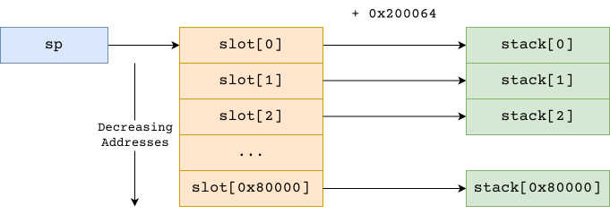

+++
title = "MoVfuscator"
date = "2026-02-23"
summary = "Introduction to MoVfuscator"
math = true
tags = ["re", "asm"]
toc = true
readTime = true
+++

## Turing Completeness

A language is said to be turing complete if it can simulate a [Turing Machine](https://en.wikipedia.org/wiki/Turing_machine).

If you are not that familiar with the Theory of Computation, you can think like if the language can evaluate a [Brainfuck](https://en.wikipedia.org/wiki/Brainfuck) program, it is turing complete.

## Context

The x86-64's [`mov`](https://c9x.me/x86/html/file_module_x86_id_176.html) instruction is turing complete - well some help is required from the underlying OS as well, but this is surprising isn't it?


## Implementation

MoVfuscator removes all branches and transforms a non-linear code into a linear code by:

- Making **every** meta-instruction **conditional**.
- Adding a single jump using SIGILL (that is by executing `ud2` instruction) to jump to the beginning.

This certainly makes it difficult, but *not impossible*.

## Signal Handlers

| Signal | Purpose |
| --- | --- |
| SIGSEGV | Execute System Call |
| SIGILL | Perform Jump to Initial Code |

## Stack

Here's the memory layout of the stack. 


### Theory

Taking a bit deeper look, we can see the following:

- The pointers differs by their addresses by $0x200064$
- The pointers are in increasing order by a delta of $+4$

That's the trick. Say, you have $p = 0x8604150$. Then we get:

1. $p - 0x200064$ is the address where value $p$ itself is stored.
2. $p - 0x200064 - 4$ is the address where the value $p-4$ is stored.
3. $p' = MEM[p - 0x200068]$ gives the address of $p-4$



### Summary

- `sub esp, 4` is implemented by

```asm {title="sub esp, 4"}
mov     esp, [esp - 0x200064 - 4]
```

- `add esp, 4` is implemented by

```asm{title="add esp, 4"}
mov     esp, [esp - 0x200064 + 4]
```
