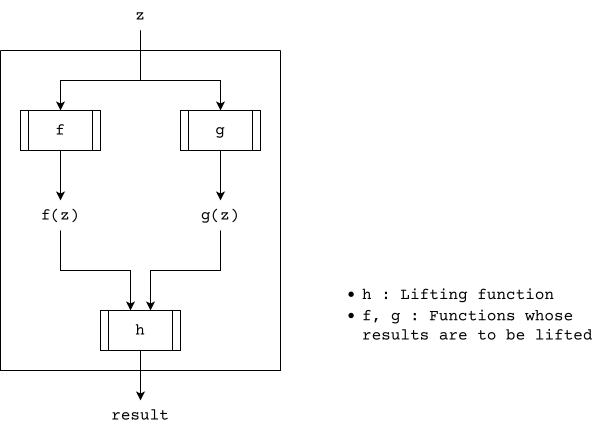

+++
title = "Applicatives"
summary = "Notes on Applicative"
date = "2026-02-27"
math = true
+++

## Applicative

```haskell
class Functor f => Applicative f where
    pure :: a -> f a
    (<*>) :: f (a -> b) -> f a -> f b
    liftA2 :: (a -> b -> c) -> f a -> f b -> f c
    (*>) :: f a -> f b -> f b
    (<*) :: f a -> f b -> f a
    {-# MINIMAL pure, ((<*>) | liftA2) #-}
```

1. Applicatives **extend** over curried functions. Why? Because `(->)` is associates from right.

Let `f1 :: a -> b -> c`. If we type match with `a -> b`, we get, `f1 :: a -> (b -> c)`. Thus 
```haskell
(<*>) :: f (a -> b -> c) -> f a -> f (b -> c)
```

2. `<*>` and `liftA2` are _functionally_ equivalent.

> A curried function (in a context) is applied with a value (in the same context) to get another curried function (in the same context).

3. Implement `liftA2` using `<*>`

- `liftA2` takes in a function without context i.e., we need to apply `pure`

```haskell
liftA2' :: (a -> b -> c) -> f a -> f b -> f c
liftA2' f a b = pure f <*> a <*> b
```

4. Implement `<*>` using `liftA2`

```haskell
-- liftA2       :: (a -> b -> c) -> f a -> f b -> f c
-- liftA2 id    :: since id :: x -> x == a -> (b -> c) == a == (b -> c)
--              :: f (b -> c) -> f b -> f c
(<*>) = liftA2 id
```

4. `liftA*` functions

```haskell
-- Control.Applicative module
liftA :: (Applicative f) => (a -> b) -> f a -> f b
liftA3 :: (Applicative f) => (a -> b -> c -> d) -> f a -> f b -> f c -> f d
```


### Composing Applicatives

```
(<*>) :: (Applicative f1) => f1 (a -> b) -> f1 a -> f1 b
(<*>) :: (Applicative f2) => f2 (c -> d) -> f2 c -> f2 d
(.) :: (y -> z) -> (x -> y) -> (x -> z)
(<*>) . (<*>) ::
    (y -> z)    ==  f1 (a -> b) -> (f1 a -> f1 b)
    (x -> y)    ==  f2 (c -> d) -> (f2 c -> f2 d)
 =>
    x == f2 (c -> d)
    z == (f1 a -> f1 b)
    y == (f2 c -> f2 d) == f1 (a -> b) => (->) (f2 c) (f2 d) == f1 (a -> b)
        => f1 == (-> (f2 c)) why? because type constructors should match - Hindley Milner Unification
            a -> b = f2 d
        => (->) a b = f2 d
        => f2 == (-> a)
            d == b
Thus
    x -> z ::
            (f2 (c -> d)) -> (f1 a -> f1 b)
          = ((-> a) (c -> d)) -> ((-> (f2 c)) a -> (-> (f2 c)) b)
          = (a -> c -> d) -> ((-> (f2 c)) a -> (-> (f2 c)) b)
          = (a -> c -> b) -> ((-> (a -> c)) a -> (-> (a -> c)) b)
          = (a -> c -> b) -> ((a -> c) -> a) -> ((a -> c) -> b)
```

So, we have:

```haskell
(<*>).(<*>) :: (a -> c -> b) -> ((a -> c) -> a) -> ((a -> c) -> b)
```

Let's try one level more:

```
(.) :: (y -> z) -> (x -> y) -> (x -> z)
(<*>) . (<*>) . (<*>)  ::
    (<*>) . ((<*>) . (<*>))
    (y -> z)    ==  f1 (k -> l) -> (f1 k -> f1 l)
    (x -> y)    ==  (a -> c -> b) -> (((a -> c) -> a) -> ((a -> c) -> b))

    f1 (k -> l) == (((a -> c) -> a) -> ((a -> c) -> b))
                == (->) ((a -> c) -> a) ((a -> c) -> b)
 => f1          == (-> ((a -> c) -> a))
    (k -> l)    == ((a -> c) -> b)
 => k           == a -> c
    l           == b

Therefore:
    x -> z ::   x -> (f1 k -> f1 l)
            =   (a -> c -> b) -> ((-> ((a -> c) -> a)) k -> (-> ((a -> c) -> a)) l)
            =   (a -> c -> b) -> (((a -> c) -> a) -> k) -> (((a -> c) -> a) -> l)
            =   (a -> c -> b) -> (((a -> c) -> a) -> (a -> c)) -> (((a -> c) -> a) -> b)
```

So, we have:

```haskell
(<*>) . (<*>)           :: (a -> c -> b) -> ((a -> c) -> a) -> ((a -> c) -> b)
(<*>) . (<*>) . (<*>)   :: (a -> c -> b) -> (((a -> c) -> a) -> (a -> c)) -> (((a -> c) -> a) -> b)
```

### Functions as Applicatives

Recall the defination of `Applicative` is

```haskell {title="Applicative"}
class Functor f => Applicative f where
    pure :: a -> f a
    (<*>) :: f (a -> b) -> f a -> f b
```

Since we already know from that [`(-> a)`](/notes/functor) is a functor, it's worth checking if it can satisfy `Applicative`

Let's try to use `f = (-> z)` since `a` and `b` are used in the class definition. 

```
pure :: a -> (-> z) a
      = a -> (z -> a)

(<*>) :: f (a -> b) -> f a -> f b
       = ((-> z) (a -> b)) -> ((-> z) a) -> ((-> z) b)
       = (z -> (a -> b)) -> (z -> a) -> (z -> b)
       = (z -> a -> b) -> (z -> a) -> z -> b

liftA2 :: (a -> b -> c) -> f a -> f b -> f c
        = (a -> b -> c) -> ((-> z) a) -> ((-> z) b) -> ((-> z) c)
        = (a -> b -> c) -> (z -> a) -> (z -> b) -> (z -> c)
```

Beautiful! There's already a function for `pure` => `const :: a -> b -> a`
Wait.. `liftA2` is mind blowing! Let's see how



So basically - `liftA2` on functions performs "lifting" on "results" of two functions and combines them into a super function

Classic Example:

```haskell
isOdd n = n % 2 == 1
isDivBy k n = mod n k == 0

isOddMultipleOf5 = liftA2 (&&) isOdd (isDivBy 5)
```

Beautiful! Isn't it?

```haskell
table = [(+1), (*2), (*3)]
args = [1..5]
output = table <*> args
-- [2,3,4,5,6, 2,4,6,8,10, 3,6,9,12,15] flattened application of `table`
```
