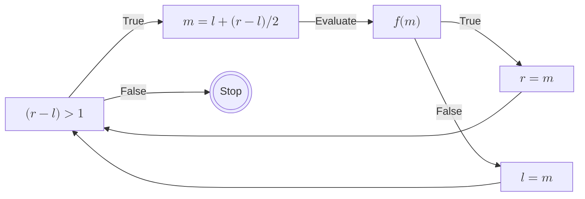

+++
title = "Binary Search"
date = "2026-02-02"
summary = "A different way to think about binary search"
math = true
tags = ["math", "algorithms"]
+++

In this post, I am going to present a different approach on how we can think about binary search.

## Defination

What is a binary search?
: Binary Search is all about dividing the search space into two halves and converging on an answer.

Binary Search is applicable if and only if, there exists a function f

- `f` partitions the space into two regions
- `f` is monotonic (once it changes value, it never changes back)

At each step, evaluating `f` allows us to discard one half of the search space.


Binary Search works by keeping track of these partitions!

## Algorithm

### Assumptions

- We want to search in the closed interval of indices $\left [ L, R\right ]$
- We maintain two boundaries l and r such that:
  – all indices $0 \leq l$ belong to Partition #1
  – all indices $r \leq R$ belong to Partition #2
- The active search space is the open interval $\left (l, r \right )$

### Initialization

- $l = L-1$, and $r = R+1$ with these values, we satisfy the above assumptions.

### Iteration



At every step we update either the partition #1 or partition #2

### Termination

We iterate until the search space is completely visited. At the end, we would have the invariant

$$l+1 = r$$

### Pseudocode

```python {title = "Binary Search"}
def binary_search(l: int, r: int, f: Callback[[int], bool]) -> tuple[int, int]:
    left, right = l-1, r+1
    # while there is atleast one unvisited element
    while right-left > 1:
        mid = left + (right-left) // 2
        if f(mid):
            # for all indexes, mid <= k <= r, f is True
            right = mid
        else:
            # for all indexes, l <= k <= mid, f is False
            left = mid
    return left, right
```
