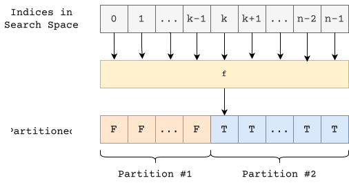
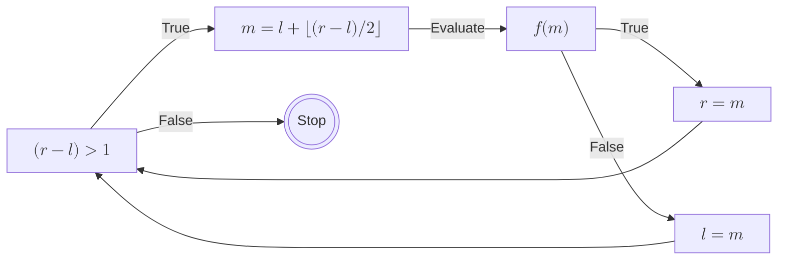
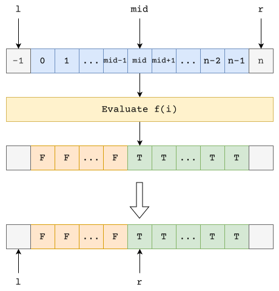
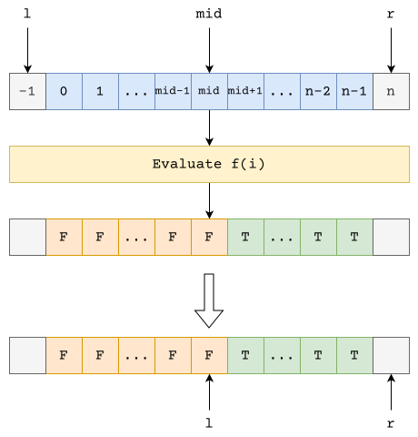
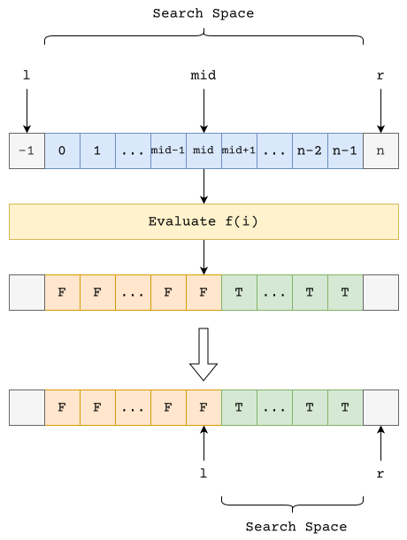
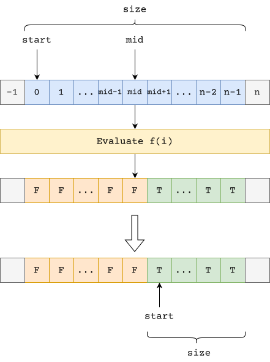

+++
title = "Binary Search"
date = "2026-02-02"
summary = "A different way to think about binary search"
math = true
tags = ["math", "algorithms"]
toc = true
+++

In this post, I am going to present a different approach on how we can think about binary search.

# Definition

What is a binary search?
: Binary Search is all about dividing the search space into two halves and converging on an answer.

Binary Search is applicable if and only if, there exists a function f

- `f` partitions the space into two regions
- `f` is monotonic (once it changes value, it never changes back)

At each step, evaluating `f` allows us to discard one half of the search space.



Binary Search works by keeping track of these partitions!

# Algorithm

## Assumptions

- We want to search in the closed interval of indices $\left [ L, R\right ]$
- We maintain two boundaries l and r such that:
  – all indices $0 \leq l$ belong to Partition #1
  – all indices $r \leq R$ belong to Partition #2
- The active search space is the open interval $\left (l, r \right )$

## Initialization

- $l = L-1$, and $r = R+1$ with these values, we satisfy the above assumptions.

## Iteration



At every step we update either the partition #1 or partition #2

### Update Right Partition



### Update Left Partition



## Termination

We iterate until the search space is completely visited. At the end, we would have the invariant

$$l+1 = r$$

# Pseudocode

Here is an implementation of the algorithm in python

```python {title = "Binary Search"}
def binary_search(l: int, r: int, f: Callback[[int], bool]) -> tuple[int, int]:
    left, right = l-1, r+1
    # while there is atleast one unvisited element
    while right-left > 1:
        mid = left + (right-left) // 2
        if f(mid):
            # for all indexes, mid <= k <= r, f is True
            right = mid
        else:
            # for all indexes, l <= k <= mid, f is False
            left = mid
    return left, right
```

## Notes

At every step we assign `mid` not `mid+1` or `mid-1`.  
Because we maintain our invariant:  
  1. `[l, left]` is the first partition (false values)
  2. `[r, right]` is the second partition (truth values)

# Time Complexity

Initially there are $N = r-l+1$ elements in the search space.

At every iteration, we have $m = l+ \lfloor (r-l)/2 \rfloor$.

$$
\begin{aligned}
N' &= \max(r-m, m-l) \\
 &= \max(r - (l + \lfloor (r-l)/2 \rfloor), l + \lfloor (r-l)/2 \rfloor - l) \\
 &= \max((r - l) - \lfloor (r-l)/2 \rfloor, \lfloor (r-l)/2 \rfloor) \\
 &= \max(\lceil(r-l)/2\rceil, \lfloor (r-l)/2 \rfloor) \\
 &= \lceil (r-l)/2 \rceil
\end{aligned}
$$

So, 

$$
\begin{aligned}
N-N' &= (r-l+1) - \lceil (r-l)/2 \rceil \\
  &= \lfloor(r-l)/2 \rfloor + 1 \\
  &\approx \lceil(r-l)/2 \rceil \\
  &= N' \\
\implies N' \approx N/2
\end{aligned}
$$

This implies we are reducing the search space by half in every iteration. 

Putting it mathematically, we have $$T(n) = T(n/2) + O(1)$$

This results in $$T(n) = O(\log_2{n})$$

# Space Complexity

Throughout the algorithm, we allocate 3 variables - $O(1)$ or constant space


# Optimization

The algorithm above finds two values:
1. First index of the partition where `f` evaluates to `true`
2. Last index of the partition where `f` evaluates to `false`

Instead of tracking the partitions, let's now focus on tracking the search space



## Renaming

We will now track only the unexplored space

1. Define $start = l+1$
2. Define $size = r-l-1$

So we have,

$$
\begin{aligned}
mid &= l + \lfloor (r-l)/2 \rfloor \\
    &= start  - 1 + \lfloor (size+1)/2 \rfloor
\end{aligned}
$$



## Case Analysis

### Case 1 - `f` evaluates to `true`

In this case, we assign $r = mid$

$$
\begin{align*}
&\implies r' = mid \\
&\implies size' + l + 1 = mid \\
&\implies size' + start = mid \\
&\implies size' + start = start - 1 + \lfloor (size+1)/2 \rfloor \\
&\implies size' = \lfloor (size+1)/2 \rfloor - 1 \\
&\implies size' = \lceil size/2 \rceil - 1
\end{align*}
$$

### Case 2 - `f` evaluates to `false`

In this case, we assign $l = mid$. Notice that $size$ and $start$ both depend on $l$. So we need to update both of them.

Let the new values of $size$ and $start$ be $size'$ and $start'$. We have,

$$
\begin{align*}
&\implies l' = mid \\
&\implies start' - 1 = start  - 1 + \lfloor (size+1)/2 \rfloor \\
&\implies start' = start + \lfloor (size+1)/2 \rfloor \\
&\implies start' = start + \lceil size/2 \rceil
\end{align*}
$$

$$
\begin{align*}
&\implies size' = r-l'-1 \\
&\implies size' = size + l + 1 - l' - 1 \\
&\implies size' = size + l - mid\\
&\implies size' = size + start - 1 - mid \\
&\implies size' = size + (start - 1) - (start - 1 + \lfloor (size+1)/2 \rfloor) \\
&\implies size' = size - \lfloor (size+1)/2 \rfloor \\
&\implies size' = size - \lceil size/2 \rceil \\
&\implies size' = \lfloor size/2 \rfloor
\end{align*}
$$

### Special Case

When $size$ is odd, that is $size \equiv 1 \bmod 2$, we have

$$
\lfloor size/2 \rfloor \equiv \lceil size/2 \rceil - 1
$$

Which means the value of $size'$ is independent of the result of $f$.

### Initial Values

$$
\begin{align*}
&start = l + 1 \\
&\implies start = L - 1 + 1 \\
&\implies start = L
\end{align*}
$$

$$
\begin{align*}
&size = r - l - 1\\
&\implies size = (R + 1) - (L - 1) - 1 \\
&\implies size = R - L + 1
\end{align*}
$$

### Condition

$$
\begin{align*}
&r - l > 1 \\
&\implies r - l - 1 > 0 \\
&\implies size > 0
\end{align*}
$$

# Refactored Algorithm

## Initial Rewrite

```python {title = "Initial Rewrite"}
start = l
size = r - l + 1
while size > 0:
    half = (size + 1) // 2
    mid = start + half - 1
    if f(mid):
        size = half - 1
    else:
        start = start + half
        size = size // 2
```

## Inlining

```python {title = "Inlining"}
start = l
size = r - l + 1
while size > 0:
    half = (size + 1) // 2
    if f(start + half - 1):
        size = half - 1
    else:
        start = start + half
        size = size // 2
```

# Optimized Implementation

```python {title = "Binary Search"}
def binary_search(l: int, r: int, f: Callback[[int], bool]) -> tuple[int, int]:
    start = l
    size = r - l + 1
    while size > 0:
        half = (size + 1) // 2
        if f(start + half - 1):
            size = half - 1
        else:
            start += half
            size //÷ 2
    return start-1, start
```

> That's the beauty of mathematical invariants $\implies$ fearless refactoring!
